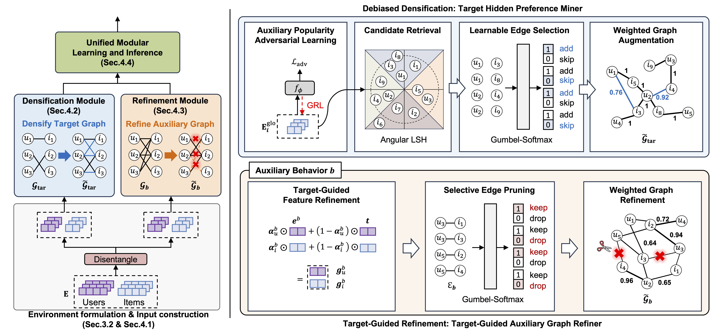

# BOAR: Beyond Observed Auxiliary Relations

> **Beyond Observed Auxiliary Relations: Environment-Conditioned Modeling for Multi-Behavior Recommendation**

<div align="center">



</div>

BOAR is a multi-behavior recommendation framework that goes beyond observed auxiliary relations by incorporating environment-conditioned modeling.

---

## Prerequisites

Create a conda environment and install the required packages:

```bash
conda create -n BOAR python=3.9
conda activate BOAR
pip install -r requirements.txt
```

---

## Usage

Training BOAR consists of two stages.

### Stage 1: Propensity Score Estimation

Before training the main model, you first need to estimate propensity scores. Navigate to the `get_propensity` directory and run:

```bash
cd get_propensity
python ./src/main.py --dataset jdata
```

### Stage 2: Train BOAR

Once the propensity scores are ready, go back to the root directory and train the full BOAR model:

```bash
cd ..
python ./src/main.py --dataset jdata
```
---
